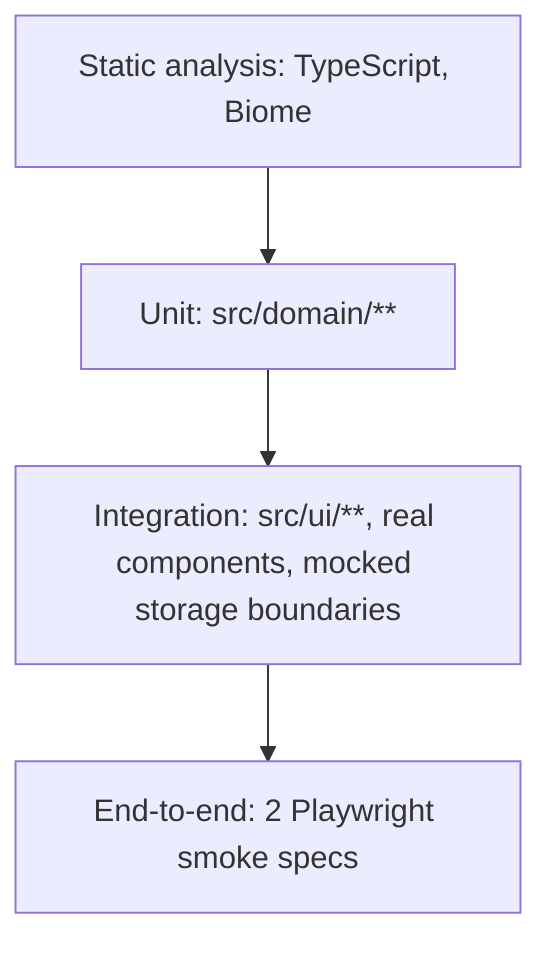

# Contributing

## Getting started

```sh
pnpm install
pnpm dev
```

Bun works too, if you'd rather not install pnpm: `bun install && bunx --bun run dev`.

## TDD

Domain code (`src/domain/**`) is written test-first: red, green, refactor. A behavior
change starts with a failing spec next to the class it exercises (`__spec__/`), then the
smallest change that passes it, then a cleanup pass with the tests as a safety net. Two
concrete examples from this codebase's own history:

- `LocalStorageWelcomeSurveyRepository.getSurvey()` had a cache bug that made it return
  `null` forever. The regression spec (`should read a survey that was written to storage
  by another instance`) fails against the old code and passes against the fix, so it
  cannot silently come back.
- `Product.getLoreLink`/`getVideoUrl` used to have three branches that all returned the
  same expression. Giving each knowledge level distinct fixture data in the spec, instead
  of one profile reused three times, is what made the dead branches visible.

## The testing trophy

Effort is weighted toward the middle, not the extremes:



- **Static**: `pnpm typecheck` and `pnpm check` catch a whole class of bugs before a test
  even runs.
- **Unit** (`vitest --project unit`, node environment): every domain class, one behavior
  per test. This is most of the suite, domain logic has no framework to fight.
- **Integration** (`vitest --project integration`, jsdom): renders real components with
  `@testing-library/react` and exercises real user flows: add to cart, change quantity,
  the welcome survey save/restore. Framework wiring (React, Radix) is real; only the
  storage boundary gets mocked when a scenario the real data can't reach needs it (see
  `ShoppingCart.freeShipping.spec.tsx`).
- **End-to-end** (`pnpm test:e2e`, Playwright against a built `vite preview`): two smoke
  tests, home to shop and add-to-cart to checkout. Enough to catch a broken build, not a
  replacement for the layers below.

## Commands

| Command                | What it does                                    |
| ----------------------- | ------------------------------------------------ |
| `pnpm test`             | Runs the unit and integration Vitest projects     |
| `pnpm test:watch`       | Same, in watch mode                               |
| `pnpm test:coverage`    | Runs tests with coverage thresholds enforced      |
| `pnpm test:e2e`         | Builds nothing itself, run `pnpm build` first, then the 2 Playwright specs |
| `pnpm typecheck`        | `tsc --noEmit` across the app, tooling, and tests |
| `pnpm check`            | Biome lint + format check                         |
| `pnpm check:fix`        | Biome lint + format, writing fixes                |

## Object Calisthenics

The rules this repo tries to hold itself to, and where to see them:

1. One level of indentation per method — early returns throughout `src/domain`
2. Max ~50 lines per class — `Cart`, `CartItem`, `CartItems`
3. Wrap primitives — `Money`, `Quantity`, `ProductId`, `ProductName`
4. First-class collections — `CartItems` wraps the cart's `CartItem[]`
5. One dot per line (Law of Demeter) — `Cart.increaseQuantity(itemId)` instead of pulling
   a `Product` back out of a `CartItem` to hand it to `Cart`
6. No getters/setters unless necessary — `CartItem.id()`/`name()`/`quantity()` are
   necessary, `getProduct()` wasn't and is gone
7. No else — grep the repo, there isn't one
8. Descriptive names, single responsibility, one thing per method — the rest of it

None of this is free: it costs more classes and more indirection than the equivalent
procedural code. The trade is code whose pieces can be understood, tested, and changed
one at a time.

## Commits

Conventional Commits, scope required: `type(scope): subject`. Enforced by commitlint via
a pre-commit hook (Lefthook), not just convention.
