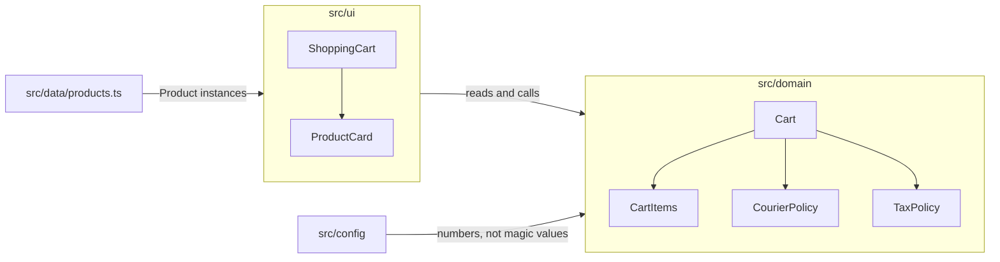
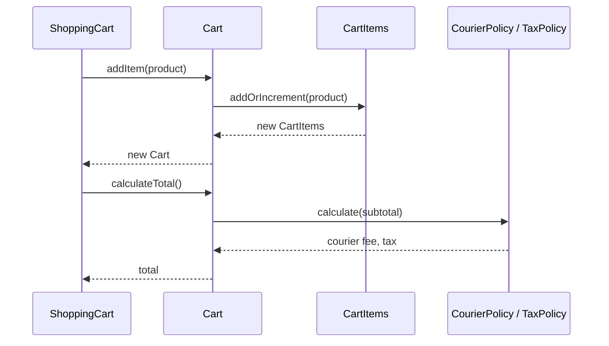

# Azeroth's Finest Wares

A demo shop illustrating [Object Calisthenics](https://williamdurand.fr/2013/06/03/object-calisthenics/)
in a React front end. It's the reference implementation for
[Applying Object Calisthenics principles](https://open.substack.com/pub/arnaudzg/p/applying-object-calisthenics-principles?r=iih51&utm_campaign=post&utm_medium=web&showWelcomeOnShare=true),
an article about keeping objects small, immutable, and well named so a codebase stays
cheap to change.

**Live demo:** <https://arnaud-zg.github.io/react-object-calisthenics/>

## What's here

A Warcraft themed shop where the domain layer does all the real work and the UI is only
a consumer of it: an immutable `Cart`, value objects instead of primitives, a first-class
collection instead of a raw array, and a `Product` that hides its own data behind
behavior. English and French, prerendered for search engines, covered by a testing
trophy.



## Object Calisthenics, applied

| Rule | Where |
| --- | --- |
| One level of indentation per method | early returns throughout `src/domain` |
| Max ~50 lines per class | `Cart`, `CartItem`, `CartItems` |
| Wrap primitives | `Money`, `Quantity`, `ProductId`, `ProductName` |
| First-class collections | `CartItems` wraps the cart's `CartItem[]` |
| One dot per line (Law of Demeter) | `Cart.increaseQuantity(itemId)`, never a `Product` pulled back out of a `CartItem` |
| No getters/setters unless necessary | `CartItem.id()`/`name()`/`quantity()` exist, `getProduct()` doesn't |
| No `else` | grep the repo |
| Small, single-responsibility classes | one reason to change, one file |

Full write-up, with the TDD history behind two of these rules, in
[CONTRIBUTING.md](./CONTRIBUTING.md#object-calisthenics).

## Adding an item to the cart



`Cart` and `CartItems` are immutable: every mutation returns a new instance instead of
changing state in place, which is what lets `useImmutableInstance` treat the cart like
any other piece of React state.

## i18n

Locale is derived from the URL, not from a switcher's local state: `/` and
`/shopping-cart` are English, `/fr/` and `/fr/shopping-cart` are French. `src/i18n/`
holds a `Locale` type, a `LocaleProvider`/`useTranslations()` pair, and one message
catalog per language (`src/i18n/messages/en.ts`, `fr.ts`). `fr.ts` is type-checked
against `en.ts`'s shape, so a missing translation is a compile error, not something a
user finds first.

## SEO and prerendering

`pnpm build` runs `scripts/prerender.mjs` after the normal Vite build: it renders every
route x locale combination with `react-dom`'s `prerenderToNodeStream` against a
memory-history router, and writes real HTML into `dist/index.html`,
`dist/shopping-cart/index.html`, `dist/fr/index.html`, and
`dist/fr/shopping-cart/index.html`. Each page gets its own title, description,
canonical URL, `hreflang` alternates, Open Graph and Twitter tags, and JSON-LD. A
`sitemap.xml` listing all four URLs is generated alongside them, and `main.tsx`
hydrates that markup on the client instead of replacing it.

## Project layout

```text
src/
├── app/            # Router setup, file-based routes, SSR entry point
├── config/         # Every configurable value, isolated: site, commerce, analytics, storage
├── data/           # The product catalog
├── domain/         # Cart, currency, and welcome-survey logic: no React in here
├── i18n/           # Locale, message catalogs, LocaleProvider
├── ui/             # Pages, components, and primitives
└── styles/         # Tailwind entry point
```

## Getting started

```sh
pnpm install
pnpm dev
```

Bun works too, if you'd rather not install pnpm: `bun install && bunx --bun run dev`.

| Command | What it does |
| --- | --- |
| `pnpm dev` | Starts the dev server on port 3000 |
| `pnpm build` | Type-checks, builds, then prerenders every route x locale |
| `pnpm preview` | Serves the built `dist/` locally |
| `pnpm test` | Runs the unit and integration Vitest projects |
| `pnpm test:coverage` | Same, with coverage thresholds enforced |
| `pnpm test:e2e` | Playwright smoke tests against a built `dist/` (run `pnpm build` first) |
| `pnpm typecheck` | `tsc --noEmit` across the app, tooling, and tests |
| `pnpm check` | Biome lint and format check |

More on the testing trophy, TDD, and commit conventions in
[CONTRIBUTING.md](./CONTRIBUTING.md).

## Deployment

CI (`.github/workflows/ci.yml`) runs typecheck, Biome, markdown lint, tests with
coverage, and the build on every push. `.github/workflows/deploy.yml` builds and
publishes `dist/` to the `gh-pages` branch on pushes to `main`, which GitHub Pages
serves from.

## License

MIT, see [LICENSE](./LICENSE).
